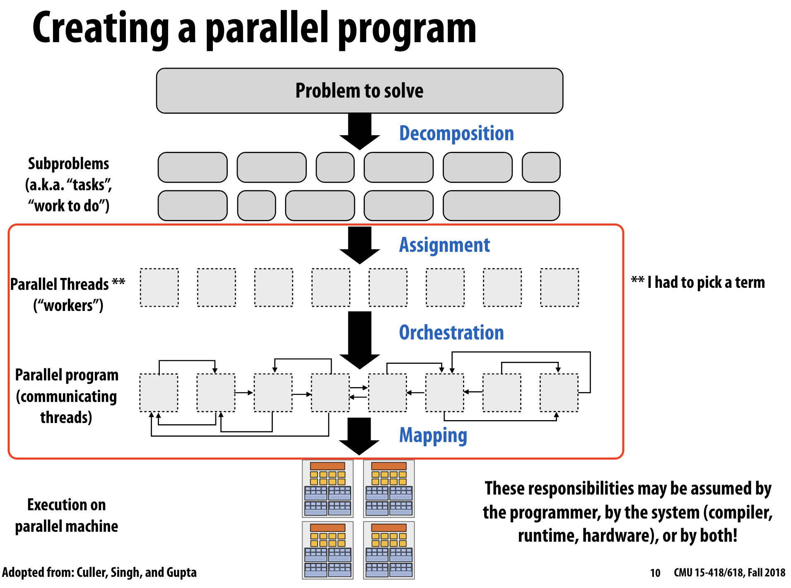

# Table of contents

# Disclaimer

本项目改编自 [CS149 assinment 2](https://github.com/stanford-cs149/asst2), 我采用了 rust 代替原本的 cpp 语言, 并在原先的基础上做出了一些修改

# Overview

"parasys" means Parallel Task Execution System.

运行一个并行程序分为四步
- Decomposition: 将任务分解为互不相干的子任务, 称之为 task instance
- Assignment: 将任务分配给 worker 进行处理
- Orchestration: 每个任务的工作量可能不同, 因此需要协调各个 worker 的工作量
- Mapping: 将 worker 映射到实际的物理线程(核心)上


> 图片来源: [cmu 15-418](https://www.cs.cmu.edu/afs/cs/academic/class/15418-s18/www/schedule.html)

parasys 所做的工作为红框部分
- Decomposition 由用户自己手动处理
- Mapping 由编程语言提供的抽象(e.g. `pthread` in c, `std::thread` in cpp)

# Introduction

> [!important] parasys 的主要目标是比较不同parallel task execution 实现方式在处理不同 workload 下并行任务的性能表现。

## TaskSet

对于一组互不相关的任务, 我们可以将其抽象为 `TaskSet`

``` rust
pub trait TaskSet {
    // Run task instance
    fn run_task_inst(&mut self, id : usize);

    fn get_num_tasks(&self) -> usize;
}
```

其中 `TaskSet` 中有 `num_tasks` 数量的子任务, 通过指定任务 id (id < num_tasks) 来运行指定的 task instance

## Example: Fibonacci

Fibonacci 数列是我们学习递归时很常见的一个例子.
给定一个数组 [2, 4, 6 , 9, 43, 54], 分别计算他们的 Fibonacci 并存储到 output 当中. 我们很清楚的知道他们之间并没有 dependency, 因此可以并行计算.

我们下面这段代码采用了未优化的算法求解 Fibonacci 数, 这是由于我希望我的 workload 是 compute incentive 的, 详细信息参照 [下面这段](#workload-category)

``` rust
impl FibonacciTask {
    pub fn force_compute(n : usize) ->usize {
        if n < 2 {
            1
        } else {
            Self::force_compute(n-1) + Self::force_compute(n-2)
        }
    }
}

impl TaskSet for FibonacciTask {

    fn run_task_inst(&mut self, id : usize) {
        self.output[id] = Self::force_compute(self.idx);
    }

    fn get_num_tasks(&self) -> usize {
        self.num_tasks
    }
}

```

## TaskSys

上面的只是实现了计算一个 task instance, 而我们希望能够并行运行一**组**任务, 因此我们定义接口如下

``` rust
pub trait TaskSys {
    fn sys_name(&self) -> &str;
    // Launch bulk tasks
    fn launch_bulk_tasks<T : TaskSet>(&self,  task_set : &mut T);
}
```

每当我们想并行运行一组任务时, 应该创建 task set, 并将其作为参数传入 `TaskSys` 中

## Serial tasks execution

最简单, 最直观的就是*顺序*执行所有任务, 

``` rust
impl TaskSys for SerialTaskSys {

    fn sys_name(&self) -> &str {
        &self.name
    }

    fn launch_bulk_tasks<T : TaskSet>(&self, task_set : &mut T) {
        for i in 0..task_set.get_num_tasks() {
            task_set.run_task_inst(i);
        }
    }
}
```

我们只需要依次顺序运行任务即可

但请注意⚠️, 但这并不代表顺序执行速度一定慢, 需要根据 workload 来决定.

## workload & validation

为了方便测试, 我为每个 Task 实现了 Default trait, 即默认 workload

```rust
impl Default for FibonacciTask {
    fn default() -> Self {
        FibonacciTask {
            num_tasks : 256,
            idx : 25,
            output: vec![0; 256],
            name : String::from("Fibonacci"),
        }
    }
}
```

例如我为Fibonacci Task 定义了这样的 workload: 计算 256 个 Fibonacci(25)

同时提供了默认 workload 的 validation:

```rust
    fn valid_defualt_correct(&self) -> bool {
        for output in &self.output {
            if *output != 121393 {
                return false;
            }
        }
        true
    }
```

由于 Fibonacci(25) = 121393, 所以此处的 validation 只需要比较是否全为121393即可

> 将 workload configuration 和 correctness validation 全部封装在 `src/tasksinst` 能使代码结构更加清晰, 解耦了 workload 与 system implementation

## Wrap it up!

前文提到, parasys 的主要目标是比较不同实现方式在处理不同工作负载下并行任务的性能表现。

我们可以在 main() 函数中直接加入新的实现和新的 workload, 再运行即可
```rust
fn main() {
    
    let mut sys_vector = Vec::new();
    sys_vector.push(SerialTaskSys::new());
    // Add New sys implementation Here !
    
    let mut task_vector= Vec::new();
    task_vector.push(FibonacciTask::default());
    // Add New workload Here!


    // Execute Different tasks in Different System 
    for task in task_vector.iter_mut() {
        for sys in sys_vector.iter() {
            run_tasks(sys, task);
            println!();
        }
    }
}
```

`run_tasks` 是定义在 `src/main.rs`下的一个辅助函数, 负责运行多次任务, 取运行时间的平均值并输出结果, 根据需要自行查看

# Workload Category

我们可以将 workload 分为以下几类
- Computation incentive

# Design & Tradeoff

# Analysis